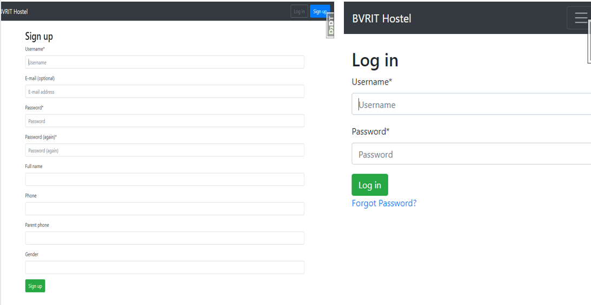
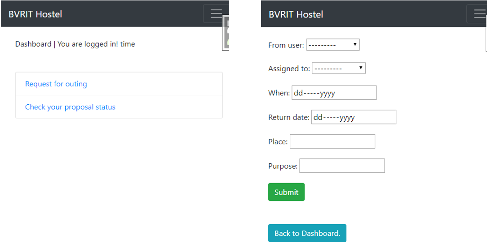

# Hostel Outing Management System

We have developed two views,each for student and warden.Through this a student can fill the outing request form and submit.The warden gets a list of student requests and can approve/decline.Meanwhile student can check his/her request status in the dashborad.


## Setup

Clone this repo using:

`$ git clone https://github.com/shashanka2a/hostel`

Configure the virtual environment:

```
$ cd hostel
$ pip3 install virtualenv
$ source venv/bin/activate
```

Now,install the project dependencies in venv using:

`(venv) $ pip install -r requirements.txt`

Set up the initial migration for our custom user models in `users` and build the database.

```
(venv) $ python manage.py makemigrations users
(venv) $ python manage.py migrate
```

Create a superuser:

`(venv) $ python manage.py createsuperuser`


## Running

In your terminal emulator:
```
(venv) $ python manage.py runserver
```
Load the site at [http://127.0.0.1:8000](http://127.0.0.1:8000).


## UI

### Signup and Login




### Student View


